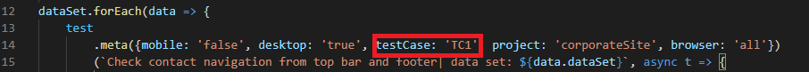

<br />
<p align="center">

  <h3 align="center">Quality Minds</h3>

  <p align="center">
    Project written in TestCafe using Javascript as a part of corporate site automation
    <br />
    <br />
    <a href="https://github.com/github_username/repo_name/issues">Report Bug</a>
    ·
    <a href="https://github.com/github_username/repo_name/issues">Request Feature</a>
  </p>
</p>

<details open="open">
  <summary><h2 style="display: inline-block">Table of Contents</h2></summary>
  <ol>
    <li>
      <a href="#about-the-project">About The Project</a>
      <ul>
        <li><a href="#built-with">Built With</a></li>
      </ul>
    </li>
    <li>
      <a href="#getting-started">Getting Started</a>
      <ul>
        <li><a href="#prerequisites">Prerequisites</a></li>
        <li><a href="#installation">Installation</a></li>
      </ul>
    </li>
    <li><a href="#usage">Usage</a></li>
    <li><a href="#detailed-project-description">Detailed Project Description</a></li>
    <li><a href="#key-points-of-task">Key Points of Task</a></li>
    <li><a href="#contact">Contact</a></li>
  </ol>
</details>

## About The Project

Project had been built using automation framework TestCafe, written in Javascript.

### Built With

* []()TestCafe
* []()Javascript
* []()html-reporter

## Getting Started

In order to install TestCafe and run tests you need to do steps below.

### Prerequisites

1. In order to run the project first thing needed is Node.js
   ```sh
   https://nodejs.org/en/
   ```

### Installation

1. Clone the repo
   ```sh
   git clone https://github.com/github_username/repo_name.git
   ```
2. Install NPM packages
   ```sh
   npm install
   ```
3. To avoid restarting computer install TestCafe globally
   ```sh
   npm install testcafe -g
   ```
4. For some of windows users there is a need to add policy in powershell in order to run any scripts on machine
   ```sh
   1. Open powerShell console as an administrator
   2. Paste this code: Set-ExecutionPolicy -ExecutionPolicy RemoteSigned -Scope LocalMachine
   ```

## Usage

Below there are examples of ways that tests could be started
1. Pre configured way to run all tests concurrently for 1 instance of chrome and 1 instance of firefox with html reporting
   ```sh
    testcafe .\tests\ 
   ```
2. Run specific test concurrently for 1 instance of chrome and 1 instance of frefox with html reporting
   ```sh
    testcafe .\tests\{testName}
    Example1: testcafe .\tests\contact-page-navigation.js
    Example2: testcafe .\tests\top-bar-and-download-verification.js
    Example3: testcafe .\tests\forms-verification.js
    Example 1,2,3 are mirroring tasks from pdf
   ```
3. Running tests without html reporting but with output directly in console
   ```sh
    testcafe .\tests\ -r spec
   ```
3. Manual override for browsers with console output, to return to html reports please remove "-r spec"
   ```sh
    testcafe chrome .\tests\ -r spec
   ```
4. Running specific test with browser override can be done in two ways
    ```sh
    testcafe chrome .\tests\{testName} -r spec
    Example: testcafe chrome .\tests\contact-page-navigation.js -r spec
    testcafe chrome .\tests\ -r spec --test-meta testCase "TC1/TC2/TC3"
    Example: testcafe chrome .\tests\ -r spec --test-meta testCase: "TC1"
     ```
5. In Order to distinguish test cases please see .meta section in every test.

<p>
    
  </a>
</p> 

6. Tests that are being run with default html reporter will store its reports in folder .report

<p>
    
  </a>
</p>     

## Detailed Project Description
 
Project have been developed using 2 main approaches:
1. Page object pattern - this approach complies with DRY rule of programming, thanks to that we can create the project as a set of reusable components. This technique speeds up not only development itself (we have components we can reuse) but also greatly improve experience of future maintenance.

<p>
    
  </a>
</p>

2. During tests following page objects have been located:
    - carreers-page.js - storage of locators and actions related to carreer page
    - contact-page.js - storage of locators and actions related to contact page
    - downloader.js - storage of locators and actions related to download it has been separated as download is common across the site
    - footer.js - due to the fact that footer is common across the pages had been distinguished as separate common module
    - general.js - this place contains actions related to getting and checking url which is common for the whole site
    - portfolio-page.js - storage of locators and actions related to carreer page
    - top-bar.js - due to the fact that top bar is common across the pages had been distinguished as separate common module

2. Data driven development - here we try to separate data layer from the code, thich technique improves management of data within the test automation.

<p>
    
  </a>
</p>

3. One set of data in json looks like following:

<p>
    
  </a>
</p>
  
  - With current set of data tests will by default execute only once, by adding new sets of data we increase number of runs for every test accordingly, below is an example of 2 sets of data which will make all tests run twice with those 2 sets of data.

<p>
    
  </a>
</p>

  - As you may see with almost no effort we have created second set of data with applyNowName changed to Jerry and applyNowEmail changed to proper one. Thanks to that we can easily verify different sets of data and different scenarios.

  4. Test structure

<p>
    
  </a>
</p>

  - All created tests are build more or less same way
  - Red section defines all imports from page object and data layer
  - Blue section is called fixture this defines starting poinf of the test and its general purpose
  - Yellow section consists of meta tags that are helpful in tests distinguishing for example we can run only tests related to mobiles or desktop on top of that there is a test itself with foreach loop that checks data layer and data sets amount nextly test name and finally execution of the test imported from specific page objects.

5. Config files

 <p>
    
  </a>
</p>

  - .env - contains data related to starting sites links as well as test users if applies
  - .testcaferc.json - config file for testCafe, you can define here everything related to timeouts, concurrency, browsers used and much more.
  - package.json - standard config defining packages that will be downladed after typing `npm i`
  - testcafe-reporter-multiple-html.json - config related to html reporter used in this project.

<!-- CONTRIBUTING -->
## Key Points of Task
1. Download

<p>
    
  </a>
</p>

  - Current solution is loggin and tracking requests going through site and checks if download has been initiated, it does not verify if file had been downloaded or its content. This have been approached that way because services like browserstack where usually tests are being run do not provide abiliy to drive access, thus solution that would be checking downloaded files on hard drive would not be versatile enough.

2. Why used env file for storage of site instead of json with data layer
  - Explanation here is simple, data stored in .env file would be defines as fragile from security perspective, thus it's good to have them in one file, that normally will be encrypted and secured, attached only when the CI will be run.
3. Parametrization
  - Most of the critical cases have been parametrized, but not all of them, this is because of subjective assesment what will be applicable for changes and what not, without deep knowledge of roadmaps and backlog it has been assesed by general experience.
4. Hover before click in some places
  - This is caused by fast loading of your site and testCafe for firefox sometimes clicks in a element which has been loaded one sec later and misses, this is a prevention measure.
5. Page objects functions are pretty granular
  - This approach is based on my experience which saves a lot of refactoring later, if something might be reused there is no point in creation of one gigantic function that does all the things from TC, because this will influence all the QA's that will be working with same code.
6. Verification if the button is on the right 
  - With functional frameworks it is sometimes hard to asses if the element is on right, due to for example of error whole site might be shifted to for example left so test will say ok button is on right but the rest of divs are shifted. To that kind of tasks I would personnaly introduce visual tests.
7. In final version with gitlab CI/CD this project would have imlemented different reporting service(allure) and yaml file that would define all of the actions needed to run it as a part of CI/CD.

## Contact

Wioletta Mikłasewicz - https://www.linkedin.com/in/wioletta-kisielewicz

